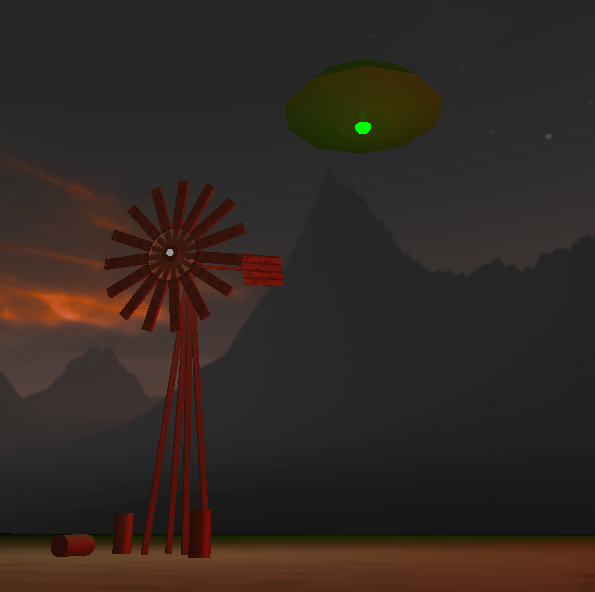

# 3D Windmill in OpenGL

OpenGL project for Computer Graphics classes at Warsaw Universtiy of Technology.

# Our team and our tasks

Wiktor Michalski - models, animation

Weronika Paszko - camera

Sebastian Pietras - configuration, lighting, shaders

Maciej Szulik - textures, skybox

# Camera controls

W - moving forwards

S - moving backwards

A - moving to the left

D - moving to the right

X - moving upwards 

Z - moving downwards

You can also look around by using mouse.

# Scene controls

Q - increasing rotation speed to the left

E - increasing rotation speed to the right

Space - dropping the turbine

Esc - closing the window

# Light controls

1 - increasing brigthness of ambient lights

2 - decreasing brigthness of ambient lights

3 - increasing brigthness of ground lights

4 - decreasing brigthness of ground lights

5 - increasing brigthness of windmill lights

6 - decreasing brigthness of windmill lights

